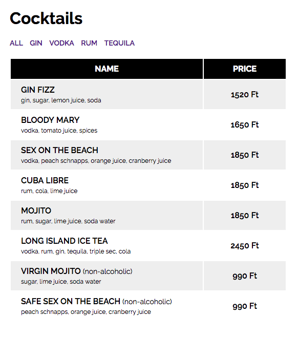

# Cocktails

---

*A filterable cocktail list*

## What to do

- Initialize a new nodejs project.
- Install both **Express** and **EJS** dependencies.
- Create a template file for the cocktail list
- Create a node web server to render templates

## How to do

### Back-end side

- Create a route for getting `/`
- In your server file, create a list of cocktails to mimic a database
  - Use this list and **do not** touch it
    ```javascript
    const cocktails = [
      {
        name: 'GIN FIZZ',
        price: 1520,
        contains: ['gin', 'sugar', 'lemon juice', 'soda'],
        isAlcoholic: true,
      },
      {
        name: 'BLOODY MARY',
        price: 1650,
        contains: ['vodka', 'tomato juice', 'spices'],
        isAlcoholic: true,
      },
      {
        name: 'SEX ON THE BEACH',
        price: 1850,
        contains: [
          'vodka',
          'peach schnapps',
          'orange juice',
          'cranberry juice'
        ],
        isAlcoholic: true,
      },
      {
        name: 'CUBA LIBRE',
        price: 1850,
        contains: ['rum', 'cola', 'lime juice'],
        isAlcoholic: true,
      },
      {
        name: 'MOJITO',
        price: 1850,
        contains: ['rum', 'sugar', 'lime juice', 'soda water'],
        isAlcoholic: true,
      },
      {
        name: 'LONG ISLAND ICE TEA',
        price: 2450,
        contains: ['vodka', 'rum', 'gin', 'tequila', 'triple sec', 'cola'],
        isAlcoholic: true,
      },
      {
        name: 'VIRGIN MOJITO',
        price: 990,
        contains: ['sugar', 'lime juice', 'soda water'],
        isAlcoholic: false,
      },
      {
        name: 'SAFE SEX ON THE BEACH',
        price: 990,
        contains: ['peach schnapps', 'orange juice', 'cranberry juice'],
        isAlcoholic: false,
      },
    ];
    ```
  - Create an array for available alcohols
    ```javascript
    const alcoholList = ['gin', 'vodka', 'rum', 'tequila'];
    ```
- Pass the two lists to frontend on render
- When a user visits the application
  - with the base route (`/`), pass the cocktails list without filtering it
  - with `/?alcohol={alcholType}` route (for example `/?alcohol=gin`), filter
    the cocktails and pass only these that contains the selected alcohol
- For static file serving, you have to set a static folder. Here is how to do
  it:
  - Create a new folder in the **root** called `static`
  - Add this line after you set up the view engine:
    ```javascript
    app.use('/static', express.static('static'));
    ```
  - Create your css file inside the `static` folder

### Front-end side

- Create a `h1` tag for title
- Create the list of selectable alcohols
- Render the cocktails with using template iteration
  - 
  - If a cocktail does not contain any alcohol, write `(non-alcoholic)` after
    its name
    - Do not rename any in the original list, use template conditional statement
- Add some style by following the preview or create your own style
  - Link a stylesheet from the `static` folder:
    ```html
    <link rel="stylesheet" type="text/css" href="/static/style.css" />
    ```
