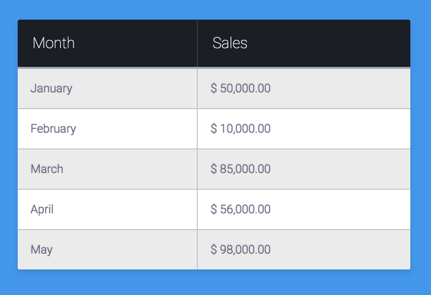
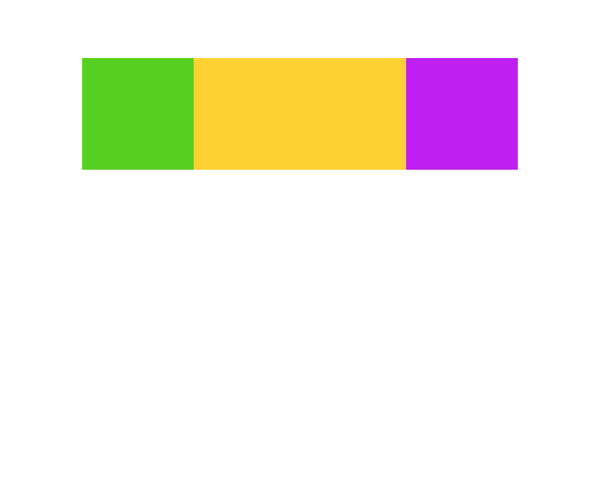
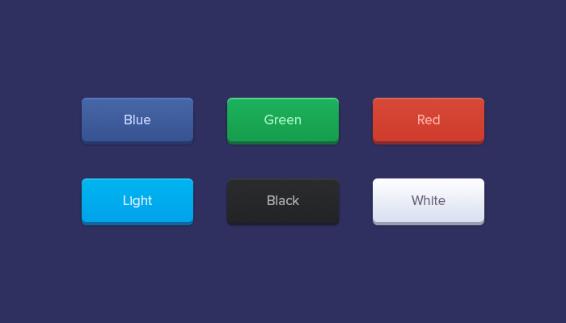
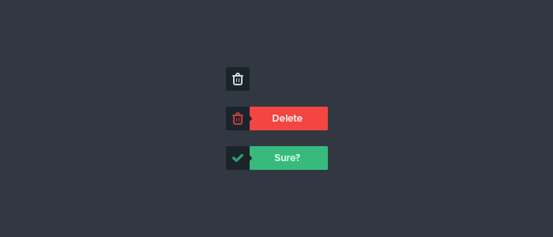

# Advanced CSS

## Materials and Resources

| Material                                                                                                                        |  Time |
| :------------------------------------------------------------------------------------------------------------------------------ | ----: |
|                                                                                                                                 |       |
| **Tables**                                                                                                                      |       |
| [Table element on MDN](https://developer.mozilla.org/en/docs/Web/HTML/Element/table)                                            |       |
| [CSS Tricks: A Complete Guide to the Table Element](https://css-tricks.com/complete-guide-table-element/)                       |       |
|                                                                                                                                 |       |
| **Responsive Web Design**                                                                                                       |       |
| [Responsive Web Design Tutorial #5 - Media Queries](https://www.youtube.com/watch?v=5xzaGSYd7jM)                                | 10:27 |
| [(Optional) Responsive Web Design Tutorials Playlist](https://www.youtube.com/playlist?list=PL4cUxeGkcC9g9Vh9MAA-XKnfJsWZnPZFw) |       |
|                                                                                                                                 |       |
| **Styling**                                                                                                                     |       |
| [CSS Tutorial For Beginners 48 - Opacity](https://www.youtube.com/watch?v=tYXQHuoaihU)                                          |  7:11 |
| [CSS Tutorial for Beginners 57 - Linear gradients](https://www.youtube.com/watch?v=n-pFwN16dr8)                                 |  6:01 |
| [CSS Tutorial For Beginners 50 - Box Shadow](https://www.youtube.com/watch?v=Q1uowGztXGs)                                       |  4:25 |
| [CSS Tutorial For Beginners 43 - Rounded Corners](https://www.youtube.com/watch?v=7WPgQVMayWI)                                  |  7:20 |
| [CSS Tutorial For Beginners 16 - Child Selectors](https://youtu.be/MlJrAhGVIis)                                                 |  3:45 |
| [CSS Tutorial For Beginners 17 - Adjacent Selectors](https://youtu.be/K92X4yyyfNY)                                              |  4:20 |
| [CSS Tutorial For Beginners 17 - Attribute Selectors](https://youtu.be/GVocONem9lw)                                             | 10:38 |
| [CSS Tutorial For Beginners 20 - Hover, Active & Visited Effects](https://www.youtube.com/watch?v=XT2PFpOyDzY)                  |  4:17 |
| [CSS Tutorials #18 - Before and After Pseudo Elements](https://www.youtube.com/watch?v=47QSujKvQ-Q)                             |  6:38 |
| [CSS Tricks Almanac: Outline](https://css-tricks.com/almanac/properties/o/outline/)                                             |       |
| [CSS Tricks Almanac: Text-shadow](https://css-tricks.com/almanac/properties/t/text-shadow/)                                     |       |

## Material Review

- table
- border-collapse
- nth-child
- media query
- colors
- opacity
- gradients
- box-shadow
- outline
- text-shadow
- border-radius
- selectors `>`, `+`
- attribute selectors
- ::before ::after

## Workshop

### Exercise: Fancy Table

- Build this table with HTML and CSS
- Each sales cell must have it's `data-currency` attribute
- Use pseudo-elements to display the currency

### Exercise: Media Query

Take the [Exercise 1.2](../layout#exercise-12) of the flexbox workshop:

If the display gets narrower than the width of the content then align the
columns vertically: 

### Exercise: Rounded buttons

- Build 3 of these buttons with HTML and CSS
- Avoid code duplication as much as possible
- Use modifier classes for color mutations
- Give the buttons different mouseover states:
  - The hover should be slightly (~10%) brighter
  - The active state should be slightly (~10%) darker

### Exercise: Labelled buttons

- By default the buttons should be closed
- When the user hovers the button, display the "delete" or "sure" labels
- Add a `data-action` attribute to the buttons it can be "delete" and "confirm"
- Use attribute selectors to set the colors on a button
- Use Fontawesome for the icons:
  [http://fontawesome.io](http://fontawesome.io/get-started/)
- Embed URL:
  <https://maxcdn.bootstrapcdn.com/font-awesome/4.7.0/css/font-awesome.min.css>

## Individual Workshop Review

Please follow the styleguide:
[Our HTML & CSS styleguide](../../styleguide/html-css.md)

- What HTML element did you use for the button and why?
- Are you sure you don't have unnecessary duplications in your code?
